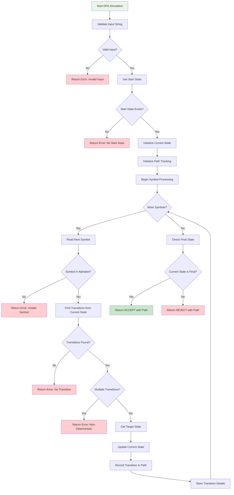
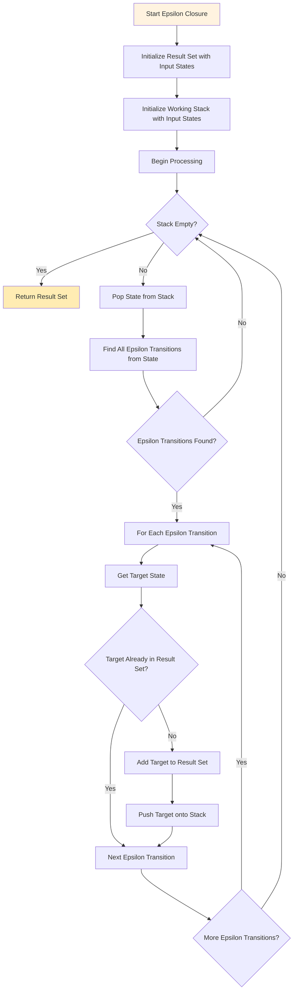
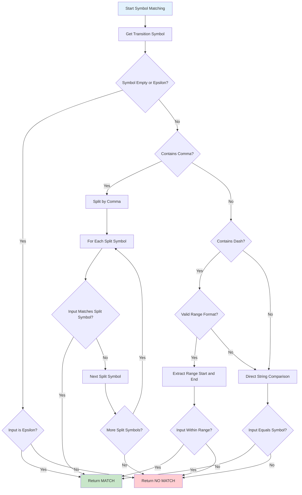
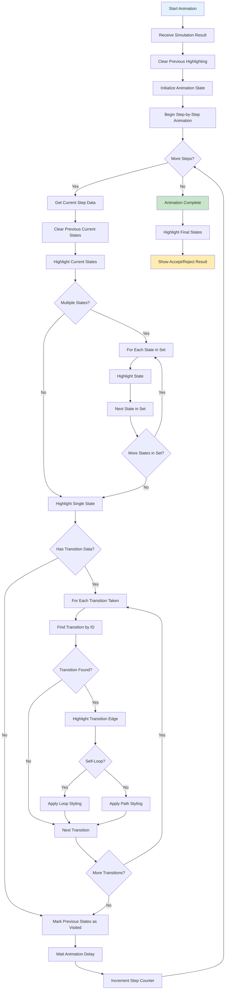

# Balanced Algorithm Flows - Automata Theory Platform

## Realistic but Understandable Algorithm Flows

These flowcharts show the **actual algorithmic complexity** without overwhelming implementation details. They capture the real decision points, loops, and edge cases that make these algorithms challenging.

---

## 1. DFA Simulation - Realistic Flow



**Key Realistic Elements:**
- **Input validation** - Real systems must validate inputs
- **Multiple error conditions** - 5 different failure modes
- **Non-determinism detection** - Critical for DFA validation
- **Path tracking** - Needed for visualization and debugging
- **Detailed transition recording** - Required for the educational features

---

## 2. NFA Simulation - The Real Complexity

```mermaid
flowchart TD
    A[Start NFA Simulation] --> B[Validate Input String]
    B --> C{Valid Input?}
    C -->|No| D[Return Error: Invalid Input]
    C -->|Yes| E[Get Start States Set]
    E --> F{Start States Exist?}
    F -->|No| G[Return Error: No Start States]
    F -->|Yes| H[Apply Epsilon Closure to Start States]
    H --> I[**EPSILON CLOSURE**]
    I --> J[Initialize Working Set with Input States]
    J --> K[Initialize Result Set]
    K --> L{Working Set Empty?}
    L -->|Yes| M[Return Result Set]
    L -->|No| N[Take State from Working Set]
    N --> O[Find All Epsilon Transitions]
    O --> P{Epsilon Transitions Found?}
    P -->|No| L
    P -->|Yes| Q[For Each Epsilon Transition]
    Q --> R[Get Target State]
    R --> S{Target Already in Result?}
    S -->|Yes| T[Next Epsilon Transition]
    S -->|No| U[Add Target to Result Set]
    U --> V[Add Target to Working Set]
    V --> T
    T --> W{More Epsilon Transitions?}
    W -->|Yes| Q
    W -->|No| L
    
    M --> X[Set Current States = Result]
    X --> Y[Initialize Path with Current States]
    Y --> Z[Begin Symbol Processing]
    Z --> AA{More Input Symbols?}
    AA -->|No| BB[Check for Final States]
    AA -->|Yes| CC[Read Next Symbol]
    CC --> DD{Symbol in Alphabet?}
    DD -->|No| EE[Return Error: Invalid Symbol]
    DD -->|Yes| FF[Initialize Next States Set]
    FF --> GG[For Each Current State]
    GG --> HH[Find All Transitions on Symbol]
    HH --> II{Transitions Found?}
    II -->|No| JJ[Next Current State]
    II -->|Yes| KK[For Each Transition]
    KK --> LL[Get Target State]
    LL --> MM[Add Target to Next States]
    MM --> NN[Record Transition Details]
    NN --> OO[Next Transition]
    OO --> PP{More Transitions?}
    PP -->|Yes| KK
    PP -->|No| JJ
    JJ --> QQ{More Current States?}
    QQ -->|Yes| GG
    QQ -->|No| RR{Next States Set Empty?}
    RR -->|Yes| SS[Return Error: Stuck]
    RR -->|No| TT[Apply Epsilon Closure to Next States]
    TT --> UU[**EPSILON CLOSURE**]
    UU --> VV[Initialize Working Set with Next States]
    VV --> WW[Initialize Result Set]
    WW --> XX{Working Set Empty?}
    XX -->|Yes| YY[Return Result Set]
    XX -->|No| ZZ[Take State from Working Set]
    ZZ --> AAA[Find All Epsilon Transitions]
    AAA --> BBB{Epsilon Transitions Found?}
    BBB -->|No| XX
    BBB -->|Yes| CCC[For Each Epsilon Transition]
    CCC --> DDD[Get Target State]
    DDD --> EEE{Target Already in Result?}
    EEE -->|Yes| FFF[Next Epsilon Transition]
    EEE -->|No| GGG[Add Target to Result Set]
    GGG --> HHH[Add Target to Working Set]
    HHH --> FFF
    FFF --> III{More Epsilon Transitions?}
    III -->|Yes| CCC
    III -->|No| XX
    
    YY --> JJJ[Update Current States]
    JJJ --> KKK[Add States to Path]
    KKK --> LLL[Record All Transitions Taken]
    LLL --> AA
    
    BB --> MMM[Check Each Current State]
    MMM --> NNN{Any State is Final?}
    NNN -->|Yes| OOO[Return ACCEPT with Path]
    NNN -->|No| PPP[Return REJECT with Path]
    
    style A fill:#e8f5e8
    style I fill:#fff3e0
    style UU fill:#fff3e0
    style OOO fill:#c8e6c9
    style D fill:#ffcdd2
    style G fill:#ffcdd2
    style EE fill:#ffcdd2
    style SS fill:#ffcdd2
    style PPP fill:#ffcdd2
```



**Key Realistic Elements:**
- **Epsilon closure called twice** - Critical NFA complexity
- **State set management** - Real NFAs work with sets of states
- **Nested loops** - Multiple levels of iteration required
- **Multiple transition handling** - Core NFA non-determinism
- **Path tracking complexity** - Must track all transitions taken

---

## 3. NFA to DFA Conversion - Subset Construction

```mermaid
flowchart TD
    A[Start NFA to DFA Conversion] --> B[Validate NFA Structure]
    B --> C{Valid NFA?}
    C -->|No| D[Return Error: Invalid NFA]
    C -->|Yes| E[Initialize Conversion Data]
    E --> F[Create State Mapping Dictionary]
    F --> G[Create Unprocessed States Queue]
    G --> H[Get NFA Start States]
    H --> I[Apply Epsilon Closure to Start States]
    I --> J[**EPSILON CLOSURE**]
    J --> K[Create DFA Start State]
    K --> L{Contains NFA Final States?}
    L -->|Yes| M[Mark DFA State as Final]
    L -->|No| N[Leave as Non-Final]
    M --> O[Add to State Mapping]
    N --> O
    O --> P[Add to Unprocessed Queue]
    P --> Q[Begin State Processing]
    Q --> R{Unprocessed Queue Empty?}
    R -->|Yes| S[Conversion Complete]
    R -->|No| T[Take Next State Set from Queue]
    T --> U[For Each Alphabet Symbol]
    U --> V[Initialize Target States Set]
    V --> W[For Each State in Current Set]
    W --> X[Find All Transitions on Symbol]
    X --> Y{Transitions Found?}
    Y -->|No| Z[Next State in Set]
    Y -->|Yes| AA[For Each Transition]
    AA --> BB[Add Target State to Set]
    BB --> CC[Next Transition]
    CC --> DD{More Transitions?}
    DD -->|Yes| AA
    DD -->|No| Z
    Z --> EE{More States in Current Set?}
    EE -->|Yes| W
    EE -->|No| FF{Target Set Empty?}
    FF -->|Yes| GG[No Transition Created]
    FF -->|No| HH[Apply Epsilon Closure to Targets]
    HH --> II[**EPSILON CLOSURE**]
    II --> JJ[Generate State Set Identifier]
    JJ --> KK{State Set Already Exists?}
    KK -->|Yes| LL[Get Existing DFA State]
    KK -->|No| MM[Create New DFA State]
    MM --> NN[Generate Unique State Name]
    NN --> OO{Contains NFA Final States?}
    OO -->|Yes| PP[Mark DFA State as Final]
    OO -->|No| QQ[Leave as Non-Final]
    PP --> RR[Add to State Mapping]
    QQ --> RR
    RR --> SS[Add to Unprocessed Queue]
    SS --> LL
    LL --> TT[Create DFA Transition]
    TT --> UU[Record Transition Details]
    UU --> GG
    GG --> VV[Next Alphabet Symbol]
    VV --> WW{More Symbols?}
    WW -->|Yes| U
    WW -->|No| R
    
    S --> XX[Generate Conversion Report]
    XX --> YY[Create Step-by-Step Log]
    YY --> ZZ[Update DFA Structure]
    ZZ --> AAA[Return DFA with Details]
    
    style A fill:#e8f5e8
    style J fill:#fff3e0
    style II fill:#fff3e0
    style S fill:#c8e6c9
    style D fill:#ffcdd2
```



**Key Realistic Elements:**
- **State explosion handling** - Can create up to 2^n states
- **Epsilon closure integration** - Called for every new state set
- **State set hashing** - Efficient duplicate detection
- **Queue-based processing** - Breadth-first state exploration
- **Detailed logging** - Educational step-by-step tracking

---

## 4. DFA Minimization - Myhill-Nerode Implementation

```mermaid
flowchart TD
    A[Start DFA Minimization] --> B[Validate DFA Structure]
    B --> C{Valid DFA?}
    C -->|No| D[Return Error: Invalid DFA]
    C -->|Yes| E[Remove Unreachable States]
    E --> F[Create Equivalence Table]
    F --> G[Initialize All Pairs as Unmarked]
    G --> H[Mark Final/Non-Final Pairs]
    H --> I[For Each State Pair (qi, qj)]
    I --> J{qi Final XOR qj Final?}
    J -->|Yes| K[Mark Pair as Distinguishable]
    J -->|No| L[Leave Unmarked]
    K --> M[Next State Pair]
    L --> M
    M --> N{More State Pairs?}
    N -->|Yes| I
    N -->|No| O[Begin Iterative Refinement]
    O --> P[Set Changed Flag = False]
    P --> Q[For Each Unmarked Pair (qi, qj)]
    Q --> R[For Each Alphabet Symbol]
    R --> S[Find δ(qi, symbol) and δ(qj, symbol)]
    S --> T[Call Target States: (qk, ql)]
    T --> U{Pair (qk, ql) Marked?}
    U -->|Yes| V[Mark (qi, qj) as Distinguishable]
    U -->|No| W[Keep Unmarked]
    V --> X[Set Changed Flag = True]
    V --> Y[Next Alphabet Symbol]
    W --> Y
    Y --> Z{More Alphabet Symbols?}
    Z -->|Yes| R
    Z -->|No| AA[Next Unmarked Pair]
    AA --> BB{More Unmarked Pairs?}
    BB -->|Yes| Q
    BB -->|No| CC{Changed Flag True?}
    CC -->|Yes| O
    CC -->|No| DD[Refinement Complete]
    DD --> EE[Group Equivalent States]
    EE --> FF[For Each Unmarked Pair]
    FF --> GG[Add to Same Equivalence Class]
    GG --> HH[Next Unmarked Pair]
    HH --> II{More Unmarked Pairs?}
    II -->|Yes| FF
    II -->|No| JJ[Create Minimized DFA]
    JJ --> KK[For Each Equivalence Class]
    KK --> LL[Create New State in Minimized DFA]
    LL --> MM{Contains Original Final State?}
    MM -->|Yes| NN[Mark New State as Final]
    MM -->|No| OO[Leave as Non-Final]
    NN --> PP[Next Equivalence Class]
    OO --> PP
    PP --> QQ{More Equivalence Classes?}
    QQ -->|Yes| KK
    QQ -->|No| RR[Create Minimized Transitions]
    RR --> SS[For Each Original Transition]
    SS --> TT[Find Source Equivalence Class]
    TT --> UU[Find Target Equivalence Class]
    UU --> VV[Create Transition in Minimized DFA]
    VV --> WW[Next Original Transition]
    WW --> XX{More Original Transitions?}
    XX -->|Yes| SS
    XX -->|No| YY[Remove Duplicate Transitions]
    YY --> ZZ[Generate Minimization Report]
    ZZ --> AAA[Return Minimized DFA]
    
    style A fill:#e8f5e8
    style O fill:#fff3e0
    style DD fill:#c8e6c9
    style D fill:#ffcdd2
```

**Key Realistic Elements:**
- **Unreachable state removal** - Important preprocessing step
- **Iterative refinement** - Multiple passes required
- **Equivalence class management** - Complex state grouping
- **Transition reconstruction** - Must rebuild transition function
- **Duplicate elimination** - Final cleanup required

---

## 5. Epsilon Closure - The Core Subroutine



**Key Realistic Elements:**
- **Stack-based processing** - Depth-first exploration
- **Duplicate prevention** - Critical for avoiding infinite loops
- **Transitive closure** - Must find all reachable states
- **Efficient implementation** - Used frequently in NFA operations

---

## 6. Symbol Matching Logic - Real Complexity



**Key Realistic Elements:**
- **Multiple symbol formats** - "a,b,c" for multiple symbols
- **Range support** - "a-z" for character ranges
- **Epsilon handling** - Special case for empty transitions
- **Input validation** - Proper range format checking

---

## 7. Visualization Animation Flow



**Key Realistic Elements:**
- **Step-by-step animation** - Timed progression through simulation
- **Multiple state highlighting** - Handle NFA state sets
- **Transition-specific highlighting** - Use database IDs for precision
- **Self-loop detection** - Special styling for loops
- **Final state emphasis** - Clear accept/reject indication

---

## Why These Flows Are "Just Right"

### **Not Too Simple:**
- Shows **real algorithmic complexity** - multiple loops, conditions, edge cases
- Includes **error handling** - realistic failure modes
- Demonstrates **data structure management** - sets, queues, mappings
- Shows **performance considerations** - epsilon closure optimization

### **Not Too Complex:**
- Omits **implementation details** - database queries, memory management
- Abstracts **technical optimizations** - caching, pooling, bulk operations
- Simplifies **error handling** - shows types but not all edge cases
- Focuses on **algorithmic logic** rather than engineering concerns

### **Key Insights These Flows Reveal:**

1. **Epsilon Closure is Critical** - Called multiple times, complex subroutine
2. **State Set Management** - NFAs work with sets of states, not single states
3. **Multiple Decision Points** - Many places where algorithms can branch
4. **Iterative Processing** - Loops within loops are common
5. **Error Conditions** - Multiple ways algorithms can fail
6. **Path Tracking Complexity** - Visualization requires detailed tracking

These flows show why automata algorithms are **genuinely challenging** to implement correctly, while remaining **understandable** for educational purposes. They capture the **real computer science** without overwhelming engineering details.
