# Automata Theory Learning Platform - Comprehensive Documentation

## Table of Contents
1. [System Overview](#system-overview)
2. [Architecture](#architecture)
3. [Core Functionalities](#core-functionalities)
4. [Technologies Used](#technologies-used)
5. [Database Schema](#database-schema)
6. [API Documentation](#api-documentation)
7. [Algorithms Implementation](#algorithms-implementation)
8. [Visualization System](#visualization-system)
9. [User Interface](#user-interface)
10. [Educational Examples](#educational-examples)
11. [Development Guide](#development-guide)
12. [System Flow Diagrams](#system-flow-diagrams)

---

## System Overview

The **Automata Theory Learning Platform** is a comprehensive web-based educational tool designed to help students and educators understand finite automata theory through interactive visualization and hands-on learning.

### Purpose
- **Educational**: Teach concepts of DFA, NFA, and automata conversions
- **Interactive**: Provide real-time visualization of automata behavior
- **Practical**: Allow users to create, test, and analyze automata
- **Comprehensive**: Cover all major automata theory topics

### Key Features
- Interactive automata creation and editing
- Real-time string simulation with step-by-step visualization
- NFA to DFA conversion with detailed steps
- DFA minimization using Myhill-Nerode theorem
- Extensive library of educational examples
- User management and progress tracking

---

## Architecture

### High-Level Architecture

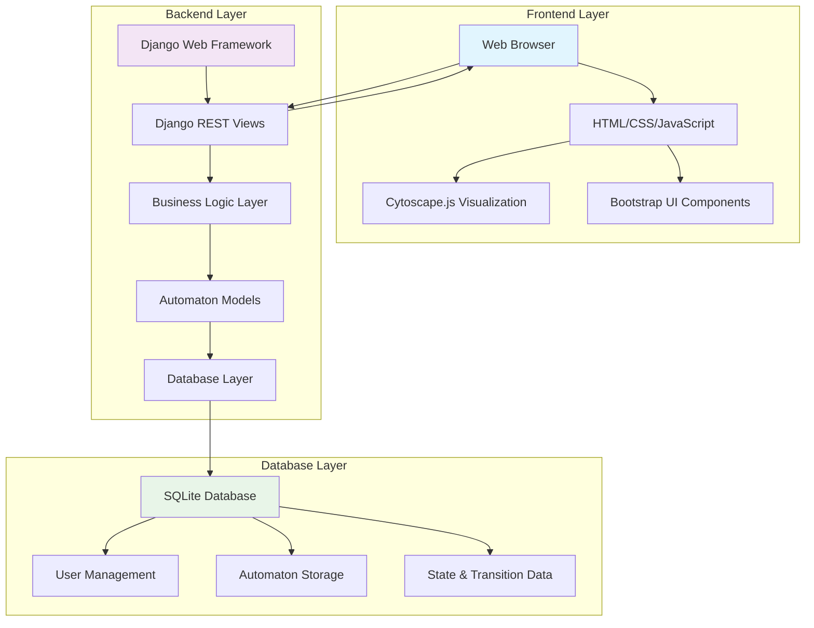

### System Architecture Components

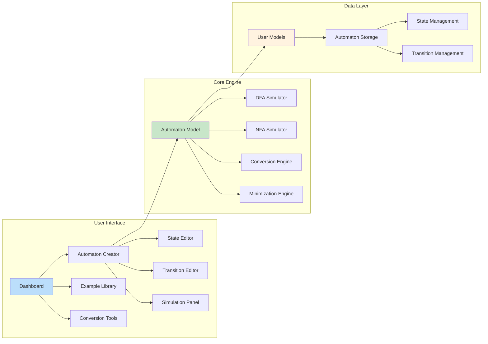

---

## Core Functionalities

### 1. Automaton Creation and Management

#### Features
- **Interactive State Creation**: Click-to-add states with customizable names
- **Transition Management**: Define transitions with multiple symbols support
- **Visual Editing**: Real-time visual feedback during editing
- **Validation**: Automatic validation of automaton structure

#### Technical Implementation
```python
# Core Model Structure
class Automaton(models.Model):
    name = models.CharField(max_length=200)
    alphabet = models.CharField(max_length=500)
    owner = models.ForeignKey(User, on_delete=models.CASCADE)
    is_example = models.BooleanField(default=False)
    has_epsilon = models.BooleanField(default=False)
    
    def get_type(self):
        """Determines if automaton is DFA, NFA, or Invalid"""
        # Implementation details...
```

### 2. String Simulation

#### DFA Simulation Flow
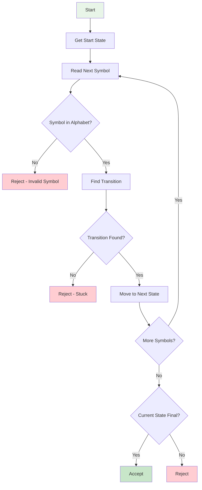

#### NFA Simulation Flow
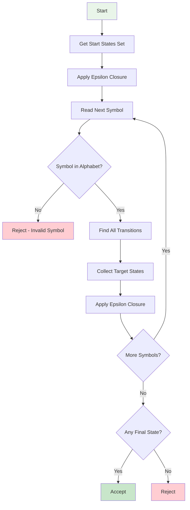

### 3. NFA to DFA Conversion

#### Subset Construction Algorithm
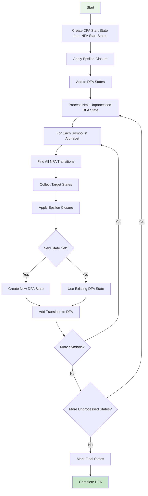

### 4. DFA Minimization

#### Myhill-Nerode Theorem Implementation
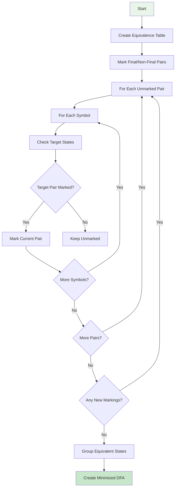

---

## Technologies Used

### Backend Technologies
- **Django 4.2+**: Web framework for backend development
- **Python 3.8+**: Programming language
- **SQLite**: Database for development (PostgreSQL for production)
- **Django REST Framework**: API development

### Frontend Technologies
- **HTML5**: Structure and semantics
- **CSS3**: Styling and responsive design
- **Bootstrap 5**: UI framework and components
- **JavaScript ES6+**: Interactive functionality
- **Cytoscape.js**: Graph visualization library

### Development Tools
- **Git**: Version control
- **Django Management Commands**: Database management
- **Django Admin**: Administrative interface

### Libraries and Dependencies
```json
{
  "backend": {
    "django": "4.2+",
    "django-extensions": "Development utilities",
    "python-decouple": "Configuration management"
  },
  "frontend": {
    "cytoscape": "3.x",
    "bootstrap": "5.x",
    "font-awesome": "6.x"
  }
}
```

---

## Database Schema

### Entity Relationship Diagram
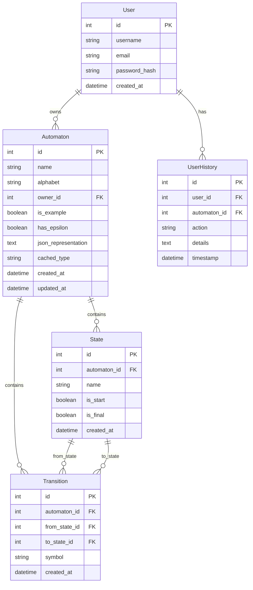

### Database Models Detail

#### Automaton Model
```python
class Automaton(models.Model):
    name = models.CharField(max_length=200)
    alphabet = models.CharField(max_length=500)  # Comma-separated
    owner = models.ForeignKey(User, on_delete=models.CASCADE)
    is_example = models.BooleanField(default=False)
    has_epsilon = models.BooleanField(default=False)
    json_representation = models.TextField(blank=True)
    cached_type = models.CharField(max_length=20, blank=True)
    created_at = models.DateTimeField(auto_now_add=True)
    updated_at = models.DateTimeField(auto_now=True)
```

#### State Model
```python
class State(models.Model):
    automaton = models.ForeignKey(Automaton, related_name='states', on_delete=models.CASCADE)
    name = models.CharField(max_length=50)
    is_start = models.BooleanField(default=False)
    is_final = models.BooleanField(default=False)
    created_at = models.DateTimeField(auto_now_add=True)
```

#### Transition Model
```python
class Transition(models.Model):
    automaton = models.ForeignKey(Automaton, related_name='transitions', on_delete=models.CASCADE)
    from_state = models.ForeignKey(State, related_name='outgoing_transitions', on_delete=models.CASCADE)
    to_state = models.ForeignKey(State, related_name='incoming_transitions', on_delete=models.CASCADE)
    symbol = models.CharField(max_length=50)  # Supports multiple symbols: "a,b,c"
    created_at = models.DateTimeField(auto_now_add=True)
```

---

## API Documentation

### Core API Endpoints

#### Automaton Management
```http
GET /api/automaton/{id}/          # Get automaton details
POST /api/automaton/              # Create new automaton
PUT /api/automaton/{id}/          # Update automaton
DELETE /api/automaton/{id}/       # Delete automaton
```

#### State Management
```http
POST /api/automaton/{id}/state/   # Add state
PUT /api/state/{id}/              # Update state
DELETE /api/state/{id}/           # Delete state
```

#### Transition Management
```http
POST /api/automaton/{id}/transition/  # Add transition
DELETE /api/transition/{id}/          # Delete transition
```

#### Simulation and Analysis
```http
GET /api/automaton/{id}/simulate/?input_string=test  # Simulate string
POST /api/automaton/{id}/to-dfa/                     # Convert NFA to DFA
POST /api/automaton/{id}/minimize/                   # Minimize DFA
```

### API Response Examples

#### Simulation Response
```json
{
  "accepted": true,
  "message": "String accepted.",
  "path": [["q0"], ["q1"], ["q1", "q2"]],
  "detailed_path": {
    "states": [["q0"], ["q1"], ["q1", "q2"]],
    "transitions": [
      [{"from_state": "q0", "to_state": "q1", "symbol": "1", "transition_id": 123}],
      [
        {"from_state": "q1", "to_state": "q1", "symbol": "0", "transition_id": 124},
        {"from_state": "q1", "to_state": "q2", "symbol": "0", "transition_id": 125}
      ]
    ],
    "symbols": ["1", "0"]
  }
}
```

#### Conversion Response
```json
{
  "dfa_id": 456,
  "steps": [
    {
      "step": 1,
      "description": "Create DFA start state",
      "start_states": ["q0"],
      "epsilon_closure": ["q0"]
    },
    {
      "step": 2,
      "description": "State Construction Process",
      "state_construction": [
        {"dfa_state": "A", "nfa_states": ["q0"], "is_start": true, "is_final": false}
      ]
    }
  ]
}
```

---

## Algorithms Implementation

### 1. Automaton Type Detection

```python
def get_type(self):
    """Determines automaton type: DFA, NFA, or INVALID"""
    if self.cached_type:
        return self.cached_type
    
    # Check for start state
    start_states = self.states.filter(is_start=True)
    if start_states.count() != 1:
        self.cached_type = 'INVALID'
        return self.cached_type
    
    # Check transitions
    alphabet = self.get_alphabet_as_set()
    for state in self.states.all():
        for symbol in alphabet:
            transitions = self.transitions.filter(from_state=state, symbol=symbol)
            if transitions.count() > 1:
                self.cached_type = 'NFA'
                return self.cached_type
            elif transitions.count() == 0:
                self.cached_type = 'NFA'
                return self.cached_type
    
    self.cached_type = 'DFA'
    return self.cached_type
```

### 2. Epsilon Closure Algorithm

```python
def epsilon_closure(self, states):
    """Calculates epsilon closure for a set of states"""
    closure = set(states)
    stack = list(states)
    
    while stack:
        state = stack.pop()
        epsilon_transitions = self.transitions.filter(from_state=state)
        
        for trans in epsilon_transitions:
            if trans.matches_symbol('ε') or not trans.symbol:
                if trans.to_state not in closure:
                    closure.add(trans.to_state)
                    stack.append(trans.to_state)
    
    return closure
```

### 3. Subset Construction Algorithm

```python
def to_dfa(self):
    """Converts NFA to DFA using subset construction"""
    # Step 1: Initialize
    start_states = self.states.filter(is_start=True)
    start_closure = self.epsilon_closure(start_states)
    
    # Step 2: Create DFA
    dfa = Automaton.objects.create(
        name=f"{self.name}_DFA",
        alphabet=self.alphabet,
        owner=self.owner,
        has_epsilon=False
    )
    
    # Step 3: Process states
    unprocessed_states = [start_closure]
    state_mapping = {}
    
    while unprocessed_states:
        current_nfa_states = unprocessed_states.pop(0)
        
        # Create DFA state
        dfa_state_name = self.generate_dfa_state_name(current_nfa_states)
        dfa_state = dfa.states.create(
            name=dfa_state_name,
            is_start=(current_nfa_states == start_closure),
            is_final=any(state.is_final for state in current_nfa_states)
        )
        
        state_mapping[frozenset(current_nfa_states)] = dfa_state
        
        # Process transitions
        for symbol in self.get_alphabet_as_set():
            target_states = set()
            for state in current_nfa_states:
                transitions = self.transitions.filter(from_state=state, symbol=symbol)
                target_states.update(trans.to_state for trans in transitions)
            
            if target_states:
                target_closure = self.epsilon_closure(target_states)
                target_key = frozenset(target_closure)
                
                if target_key not in state_mapping:
                    unprocessed_states.append(target_closure)
                
                # Create transition will be added after all states are processed
    
    return dfa
```

---

## Visualization System

### Cytoscape.js Integration

#### Graph Configuration
```javascript
const cy = cytoscape({
    container: document.getElementById('cy'),
    style: [
        {
            selector: 'node',
            style: {
                'background-color': '#ffffff',
                'border-width': 2,
                'border-color': '#1e3a8a',
                'label': 'data(name)',
                'width': 40,
                'height': 40,
                'shape': 'ellipse'
            }
        },
        {
            selector: 'edge',
            style: {
                'width': 2,
                'line-color': '#1e3a8a',
                'target-arrow-shape': 'triangle',
                'curve-style': 'bezier',
                'label': 'data(label)',
                'control-point-distance': 40
            }
        }
    ],
    layout: {
        name: 'circle',
        radius: 150,
        animate: true
    }
});
```

#### Visualization Flow
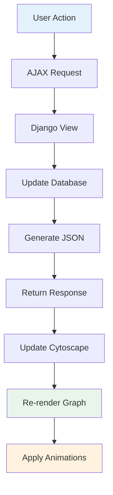

### Multiple Transitions Visualization

```javascript
function improveMultipleTransitionsVisualization(data) {
    const transitionGroups = {};
    
    // Group transitions by source-target pairs
    data.edges.forEach(edge => {
        const key = `${edge.data.source}-${edge.data.target}`;
        if (!transitionGroups[key]) {
            transitionGroups[key] = [];
        }
        transitionGroups[key].push(edge);
    });
    
    // Apply different control point distances
    Object.keys(transitionGroups).forEach(key => {
        const transitions = transitionGroups[key];
        if (transitions.length > 1) {
            transitions.forEach((transition, index) => {
                const offset = (index - (transitions.length - 1) / 2) * 30;
                transition.data.controlPointDistance = 40 + Math.abs(offset);
                transition.data.controlPointWeight = 0.5 + (offset / 200);
            });
        }
    });
    
    return data;
}
```

### Simulation Animation

```javascript
function animateSimulation(result) {
    let stepIndex = 0;
    
    const highlightNext = () => {
        if (stepIndex < result.path.length) {
            // Handle current states
            const currentStates = Array.isArray(result.path[stepIndex]) 
                ? result.path[stepIndex] 
                : [result.path[stepIndex]];
            
            // Highlight states
            currentStates.forEach(stateName => {
                cy.getElementById(stateName).addClass('current-state');
            });
            
            // Highlight specific transitions
            if (stepIndex > 0 && result.detailed_path) {
                const transitions = result.detailed_path.transitions[stepIndex - 1];
                transitions.forEach(transition => {
                    const edge = cy.edges().filter(edge => {
                        return edge.data('pk') === transition.transition_id;
                    });
                    edge.addClass('path-edge');
                });
            }
            
            stepIndex++;
            setTimeout(highlightNext, 1000);
        }
    };
    
    highlightNext();
}
```

---

## User Interface

### Dashboard Layout
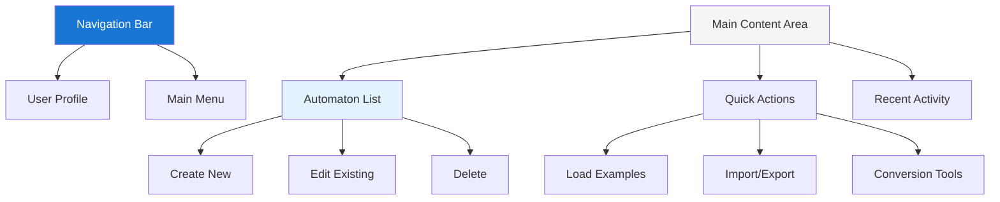

### Automaton Editor Interface
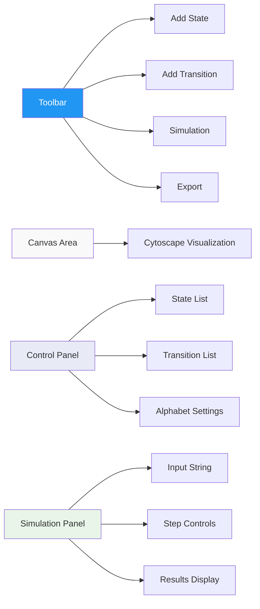

### Responsive Design Features
- **Mobile-First**: Optimized for mobile devices
- **Tablet Support**: Adapted layouts for tablet screens
- **Desktop Enhancement**: Full-featured desktop experience
- **Touch Support**: Touch-friendly controls for mobile devices

---

## Educational Examples

### Example Categories

#### 1. Basic DFA Examples
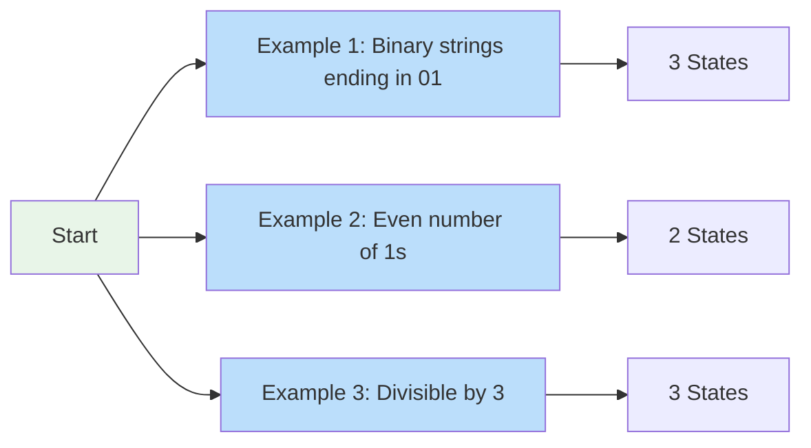

#### 2. NFA Examples
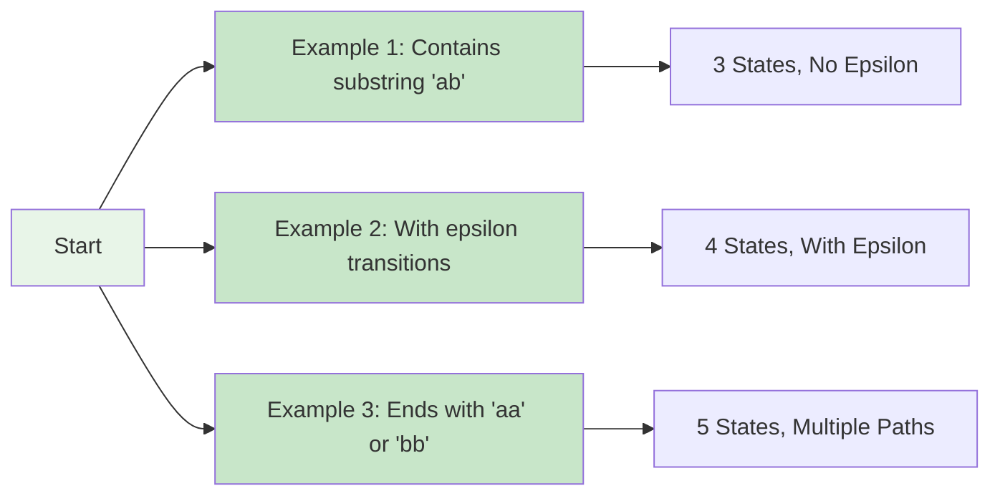

#### 3. Conversion Examples
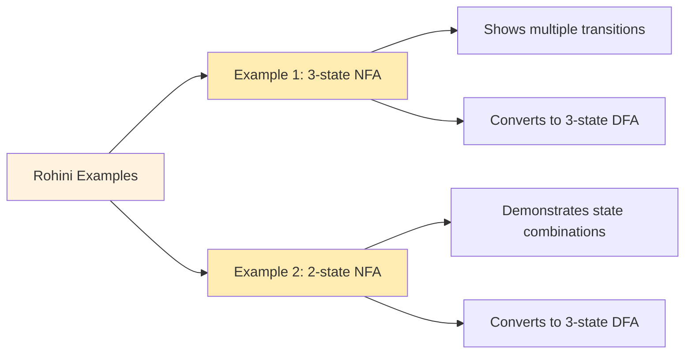

#### 4. Minimization Examples
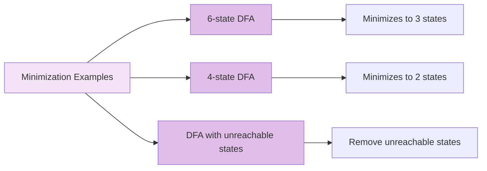

### Example Creation System

#### Management Commands
```bash
# Create all examples
python manage.py create_examples

# Create specific example sets
python manage.py create_rohini_examples
python manage.py create_minimization_examples
python manage.py create_accurate_examples
```

#### Example Structure
```python
def create_example(self, user):
    # Create automaton
    automaton = Automaton.objects.create(
        name="Example Name",
        alphabet="0,1",
        owner=user,
        is_example=True
    )
    
    # Create states
    states = []
    for i, (name, is_start, is_final) in enumerate(state_definitions):
        state = automaton.states.create(
            name=name,
            is_start=is_start,
            is_final=is_final
        )
        states.append(state)
    
    # Create transitions
    for from_idx, to_idx, symbol in transition_definitions:
        automaton.transitions.create(
            from_state=states[from_idx],
            to_state=states[to_idx],
            symbol=symbol
        )
    
    # Update JSON representation
    automaton.update_json_representation()
```

---

## Development Guide

### Setup Instructions

#### Prerequisites
```bash
# Python 3.8+
python --version

# Virtual environment
python -m venv venv
source venv/bin/activate  # Linux/Mac
venv\Scripts\activate     # Windows

# Install dependencies
pip install -r requirements.txt
```

#### Database Setup
```bash
# Run migrations
python manage.py migrate

# Create superuser
python manage.py createsuperuser

# Load example data
python manage.py create_examples
```

#### Development Server
```bash
# Run development server
python manage.py runserver

# Access application
# http://localhost:8000
```

### Code Structure

#### Directory Organization
```
automata/
├── automata/              # Django project settings
│   ├── settings.py
│   ├── urls.py
│   └── wsgi.py
├── core/                  # Main application
│   ├── models.py          # Database models
│   ├── views.py           # View controllers
│   ├── urls.py            # URL routing
│   ├── forms.py           # Form definitions
│   ├── admin.py           # Admin interface
│   ├── management/        # Management commands
│   │   └── commands/
│   ├── templates/         # HTML templates
│   │   └── automaton/
│   └── tests/             # Test files
├── static/                # Static files
├── templates/             # Global templates
└── manage.py              # Django management script
```

#### Key Files
- **`core/models.py`**: Core business logic and database models
- **`core/views.py`**: HTTP request handlers and API endpoints
- **`core/templates/automaton/automaton_detail.html`**: Main UI template
- **`core/management/commands/`**: Example creation scripts

### Testing

#### Unit Tests
```bash
# Run all tests
python manage.py test

# Run specific test file
python manage.py test core.tests
python manage.py test core.test_advanced
python manage.py test core.test_api
```

#### Test Coverage
```bash
# Install coverage
pip install coverage

# Run tests with coverage
coverage run --source='.' manage.py test
coverage report
coverage html
```

### Deployment

#### Production Settings
```python
# settings.py
DEBUG = False
ALLOWED_HOSTS = ['yourdomain.com']

# Database configuration
DATABASES = {
    'default': {
        'ENGINE': 'django.db.backends.postgresql',
        'NAME': 'automata_db',
        'USER': 'db_user',
        'PASSWORD': 'db_password',
        'HOST': 'localhost',
        'PORT': '5432',
    }
}

# Static files
STATIC_ROOT = '/var/www/static/'
STATIC_URL = '/static/'
```

#### Docker Deployment
```dockerfile
FROM python:3.9-slim

WORKDIR /app

COPY requirements.txt .
RUN pip install -r requirements.txt

COPY . .

EXPOSE 8000

CMD ["python", "manage.py", "runserver", "0.0.0.0:8000"]
```

---

## System Flow Diagrams

### Overall System Flow
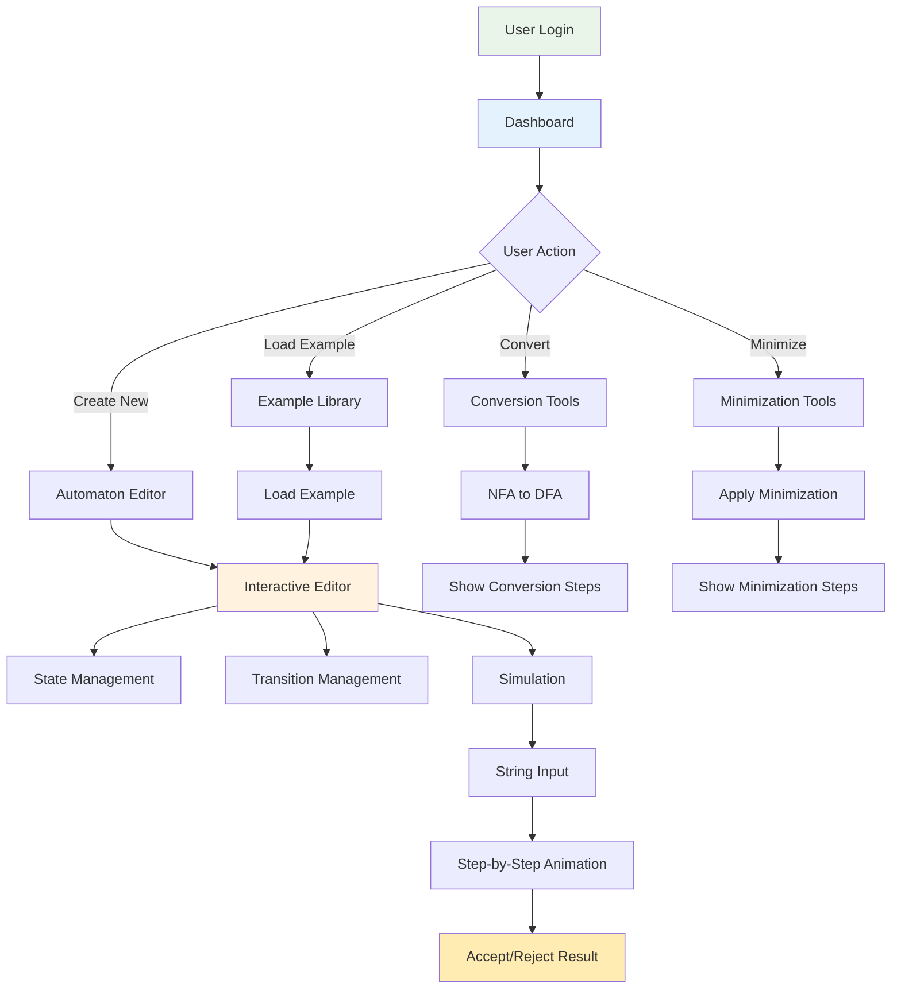

### Data Flow Architecture
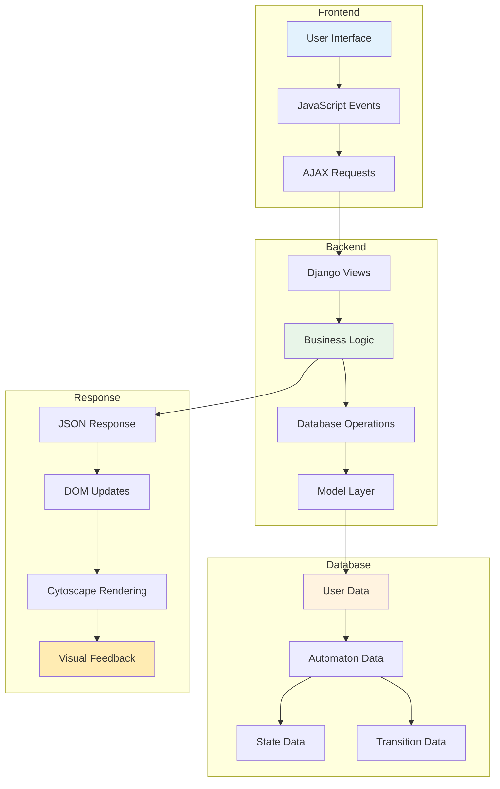

### Simulation Process Flow
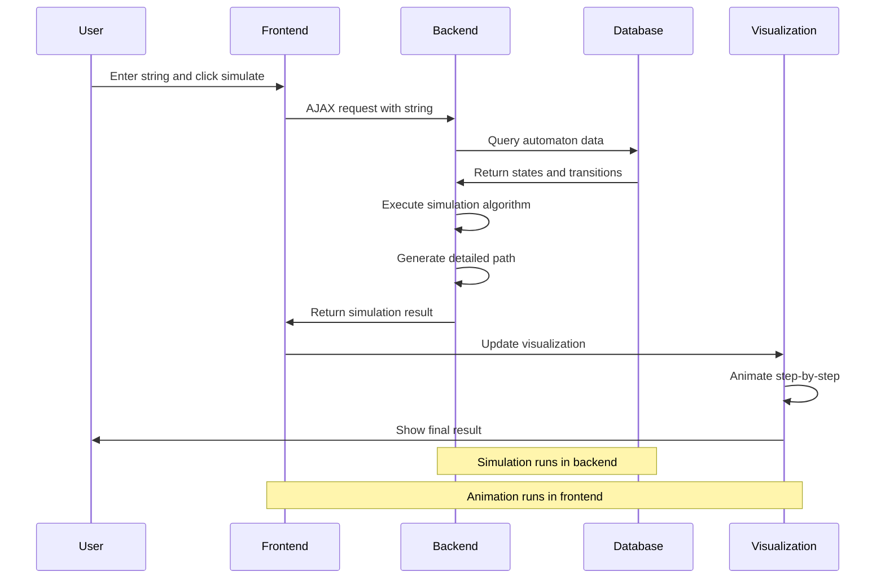

### NFA to DFA Conversion Flow
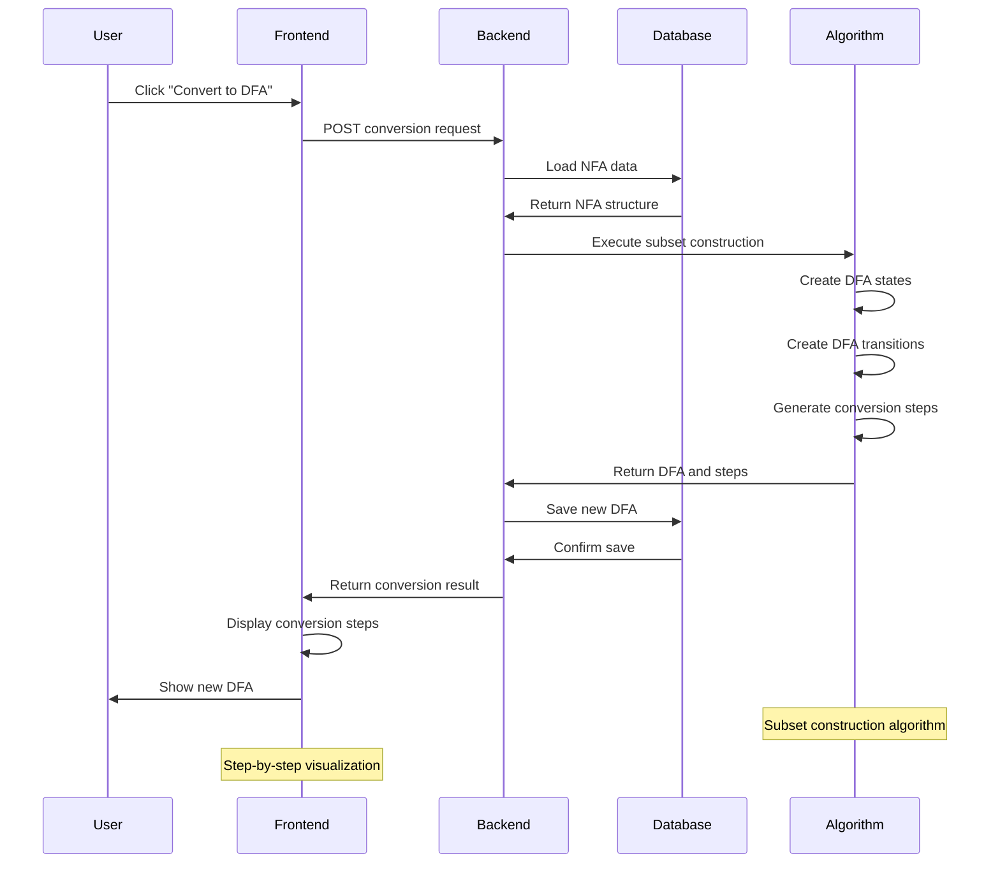

---

## Performance Considerations

### Database Optimization
- **Indexing**: Proper indexes on frequently queried fields
- **Query Optimization**: Efficient database queries using Django ORM
- **Caching**: Cached automaton type detection
- **Connection Pooling**: Efficient database connections

### Frontend Performance
- **Lazy Loading**: Load visualizations only when needed
- **Debouncing**: Prevent excessive API calls during editing
- **Efficient Rendering**: Optimized Cytoscape.js configurations
- **Memory Management**: Proper cleanup of event listeners

### Scalability Features
- **User Isolation**: Each user's data is properly isolated
- **Example Sharing**: Efficient sharing of example automata
- **Bulk Operations**: Efficient bulk data operations
- **API Rate Limiting**: Protection against abuse

---

## Security Features

### Authentication & Authorization
- **User Authentication**: Django's built-in authentication system
- **Permission Checking**: Proper permission validation
- **CSRF Protection**: Cross-site request forgery protection
- **Session Management**: Secure session handling

### Data Protection
- **SQL Injection Prevention**: Using Django ORM prevents SQL injection
- **XSS Protection**: Proper input sanitization
- **Data Validation**: Input validation on both frontend and backend
- **Access Control**: Users can only access their own data

---

## Future Enhancements

### Planned Features
1. **Advanced Algorithms**: 
   - Regular expression to automaton conversion
   - Automaton equivalence checking
   - Pumping lemma demonstrations

2. **Collaborative Features**:
   - Shared workspaces
   - Real-time collaboration
   - Assignment and grading system

3. **Export Capabilities**:
   - PDF report generation
   - LaTeX export
   - Image export in various formats

4. **Mobile App**:
   - Native mobile application
   - Offline functionality
   - Touch-optimized interface

### Technical Improvements
1. **Performance Optimizations**:
   - WebSocket support for real-time updates
   - Client-side caching
   - Progressive web app (PWA) features

2. **Advanced Visualization**:
   - 3D visualization options
   - Custom layout algorithms
   - Animation controls

3. **Integration Features**:
   - LMS integration (Moodle, Canvas)
   - API for third-party tools
   - Plugin system

---

## Conclusion

The **Automata Theory Learning Platform** provides a comprehensive, interactive environment for learning and teaching finite automata theory. With its robust architecture, intuitive interface, and powerful visualization capabilities, it serves as an effective educational tool for students, educators, and researchers in computer science.

The platform's modular design allows for easy extension and maintenance, while its comprehensive API enables integration with other educational tools and systems. The detailed documentation and example library make it accessible to users of all skill levels.

For technical support, feature requests, or contributions, please refer to the project repository and development guidelines.

---

*Documentation Version: 1.0*  
*Last Updated: 2024*  
*Platform Version: Compatible with Django 4.2+*