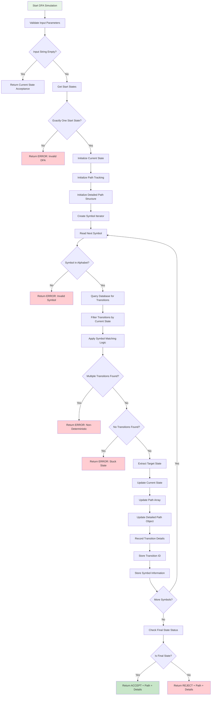

# Realistic Algorithm Flows - Automata Theory Platform

## The Real Complexity Behind the Algorithms

The simplified flowcharts in the documentation don't show the full complexity of what's actually happening. Here are the **realistic, detailed algorithm flows** that reflect the actual implementation complexity.

---

## 1. DFA Simulation - The Real Process

### Simplified Version (What I Showed):
```
Start → Read Symbol → Find Transition → Move State → Check Final
```

### **REALISTIC DFA Simulation Flow:**



**Key Complexities NOT shown in simple version:**
1. **Database Query Optimization** - Multiple queries per symbol
2. **Error Handling** - 5 different error conditions
3. **Path Tracking** - Complex data structure maintenance
4. **Transition Validation** - Symbol matching with ranges and multiple symbols
5. **Memory Management** - Efficient data structure updates

---

## 2. NFA Simulation - The REAL Complexity

### Simplified Version (What I Showed):
```
Start → Apply Epsilon Closure → Read Symbol → Find Transitions → Apply Epsilon Closure → Check Final
```

### **REALISTIC NFA Simulation Flow:**

```mermaid
flowchart TD
    A[Start NFA Simulation] --> B[Validate Input Parameters]
    B --> C[Initialize Data Structures]
    C --> D[Get All Start States]
    D --> E{Start States Exist?}
    E -->|No| F[Return ERROR: No Start State]
    E -->|Yes| G[Convert to State Set]
    G --> H[**EPSILON CLOSURE PHASE 1**]
    H --> I[Initialize Closure Stack]
    I --> J[Initialize Closure Set]
    J --> K[Add Start States to Stack]
    K --> L{Stack Not Empty?}
    L -->|No| M[Initial Closure Complete]
    L -->|Yes| N[Pop State from Stack]
    N --> O[Query Epsilon Transitions]
    O --> P[Filter by Epsilon/Empty Symbol]
    P --> Q{Epsilon Transitions Found?}
    Q -->|No| L
    Q -->|Yes| R[For Each Epsilon Transition]
    R --> S[Get Target State]
    S --> T{Target Not in Closure?}
    T -->|No| U[Next Epsilon Transition]
    T -->|Yes| V[Add to Closure Set]
    V --> W[Push to Stack]
    W --> U
    U --> X{More Epsilon Transitions?}
    X -->|Yes| R
    X -->|No| L
    
    M --> Y[Initialize Current States Set]
    Y --> Z[Initialize Path Tracking]
    Z --> AA[Initialize Detailed Path Structure]
    AA --> BB[Create Symbol Iterator]
    BB --> CC[Read Next Symbol]
    CC --> DD{Symbol in Alphabet?}
    DD -->|No| EE[Return ERROR: Invalid Symbol]
    DD -->|Yes| FF[Initialize Next States Set]
    FF --> GG[Initialize Transitions Taken Array]
    GG --> HH[For Each Current State]
    HH --> II[Query All Transitions from State]
    II --> JJ[Filter by Current Symbol]
    JJ --> KK[Apply Symbol Matching Logic]
    KK --> LL{Matching Transitions Found?}
    LL -->|No| MM[Next Current State]
    LL -->|Yes| NN[For Each Matching Transition]
    NN --> OO[Extract Target State]
    OO --> PP[Add to Next States Set]
    PP --> QQ[Record Transition Details]
    QQ --> RR[Store Transition ID]
    RR --> SS[Store From/To States]
    SS --> TT[Store Symbol]
    TT --> UU[Add to Transitions Taken]
    UU --> VV[Next Matching Transition]
    VV --> WW{More Matching Transitions?}
    WW -->|Yes| NN
    WW -->|No| MM
    MM --> XX{More Current States?}
    XX -->|Yes| HH
    XX -->|No| YY{Next States Set Empty?}
    YY -->|Yes| ZZ[Return ERROR: Stuck]
    YY -->|No| AAA[**EPSILON CLOSURE PHASE 2**]
    
    AAA --> BBB[Initialize Closure Stack]
    BBB --> CCC[Initialize Closure Set]
    CCC --> DDD[Add Next States to Stack]
    DDD --> EEE{Stack Not Empty?}
    EEE -->|No| FFF[Closure Complete]
    EEE -->|Yes| GGG[Pop State from Stack]
    GGG --> HHH[Query Epsilon Transitions]
    HHH --> III[Filter by Epsilon/Empty Symbol]
    III --> JJJ{Epsilon Transitions Found?}
    JJJ -->|No| EEE
    JJJ -->|Yes| KKK[For Each Epsilon Transition]
    KKK --> LLL[Get Target State]
    LLL --> MMM{Target Not in Closure?}
    MMM -->|No| NNN[Next Epsilon Transition]
    MMM -->|Yes| OOO[Add to Closure Set]
    OOO --> PPP[Push to Stack]
    PPP --> NNN
    NNN --> QQQ{More Epsilon Transitions?}
    QQQ -->|Yes| KKK
    QQQ -->|No| EEE
    
    FFF --> RRR[Update Current States]
    RRR --> SSS[Update Path Array]
    SSS --> TTT[Update Detailed Path]
    TTT --> UUU[Store State Set]
    UUU --> VVV[Store Transitions Taken]
    VVV --> WWW[Store Symbol]
    WWW --> XXX{More Input Symbols?}
    XXX -->|Yes| CC
    XXX -->|No| YYY[Check Final State Acceptance]
    YYY --> ZZZ[For Each Current State]
    ZZZ --> AAAA{Is Final State?}
    AAAA -->|Yes| BBBB[Return ACCEPT + Path + Details]
    AAAA -->|No| CCCC[Next Current State]
    CCCC --> DDDD{More Current States?}
    DDDD -->|Yes| ZZZ
    DDDD -->|No| EEEE[Return REJECT + Path + Details]
    
    style A fill:#e8f5e8
    style H fill:#fff3e0
    style AAA fill:#fff3e0
    style BBBB fill:#c8e6c9
    style F fill:#ffcdd2
    style EE fill:#ffcdd2
    style ZZ fill:#ffcdd2
    style EEEE fill:#ffcdd2
```



**Key Complexities NOT shown in simple version:**
1. **Double Epsilon Closure** - Applied twice per symbol
2. **State Set Management** - Complex set operations
3. **Multiple Nested Loops** - 4 levels of iteration
4. **Database Query Explosion** - O(n²) queries in worst case
5. **Memory Management** - Dynamic data structure growth
6. **Transition Tracking** - Complex array/object management

---

## 3. NFA to DFA Conversion - The REAL Beast

### Simplified Version (What I Showed):
```
Start → Create DFA Start State → Process States → Create Transitions → Done
```

### **REALISTIC Subset Construction Algorithm:**

```mermaid
flowchart TD
    A[Start NFA to DFA Conversion] --> B[Validate NFA Structure]
    B --> C[Initialize Conversion Data Structures]
    C --> D[Create State Mapping Dictionary]
    D --> E[Create Unprocessed States Queue]
    E --> F[Create DFA Alphabet Set]
    F --> G[Create Step-by-Step Log]
    G --> H[Get NFA Start States]
    H --> I{Start States Exist?}
    I -->|No| J[Return ERROR: No Start State]
    I -->|Yes| K[Apply Epsilon Closure to Start States]
    
    K --> L[**EPSILON CLOSURE SUBROUTINE**]
    L --> M[Initialize Closure Stack with Start States]
    M --> N[Initialize Closure Set]
    N --> O{Stack Not Empty?}
    O -->|No| P[Return Closure Set]
    O -->|Yes| Q[Pop State from Stack]
    Q --> R[Query NFA Epsilon Transitions]
    R --> S[For Each Epsilon Transition]
    S --> T{Target State Not in Closure?}
    T -->|No| U[Next Epsilon Transition]
    T -->|Yes| V[Add Target to Closure Set]
    V --> W[Push Target to Stack]
    W --> U
    U --> X{More Epsilon Transitions?}
    X -->|Yes| S
    X -->|No| O
    
    P --> Y[Generate DFA State Name]
    Y --> Z[Create DFA Start State in Database]
    Z --> AA[Mark as Start State]
    AA --> BB[Check if Contains NFA Final States]
    BB --> CC{Contains Final States?}
    CC -->|Yes| DD[Mark DFA State as Final]
    CC -->|No| EE[Leave as Non-Final]
    DD --> FF[Add to State Mapping]
    EE --> FF
    FF --> GG[Add to Unprocessed Queue]
    GG --> HH[Log Step Details]
    HH --> II{Unprocessed Queue Not Empty?}
    II -->|No| JJ[Conversion Complete]
    II -->|Yes| KK[Dequeue Next State Set]
    KK --> LL[For Each Symbol in Alphabet]
    LL --> MM[Initialize Target States Set]
    MM --> NN[For Each State in Current Set]
    NN --> OO[Query NFA Transitions for Symbol]
    OO --> PP[Apply Symbol Matching Logic]
    PP --> QQ[For Each Matching Transition]
    QQ --> RR[Add Target State to Set]
    RR --> SS[Next Matching Transition]
    SS --> TT{More Matching Transitions?}
    TT -->|Yes| QQ
    TT -->|No| UU[Next State in Set]
    UU --> VV{More States in Set?}
    VV -->|Yes| NN
    VV -->|No| WW{Target States Set Empty?}
    WW -->|Yes| XX[Create Dead State]
    WW -->|No| YY[Apply Epsilon Closure to Targets]
    
    YY --> ZZ[**EPSILON CLOSURE SUBROUTINE**]
    ZZ --> AAA[Initialize Closure Stack with Targets]
    AAA --> BBB[Initialize Closure Set]
    BBB --> CCC{Stack Not Empty?}
    CCC -->|No| DDD[Return Closure Set]
    CCC -->|Yes| EEE[Pop State from Stack]
    EEE --> FFF[Query NFA Epsilon Transitions]
    FFF --> GGG[For Each Epsilon Transition]
    GGG --> HHH{Target State Not in Closure?}
    HHH -->|No| III[Next Epsilon Transition]
    HHH -->|Yes| JJJ[Add Target to Closure Set]
    JJJ --> KKK[Push Target to Stack]
    KKK --> III
    III --> LLL{More Epsilon Transitions?}
    LLL -->|Yes| GGG
    LLL -->|No| CCC
    
    DDD --> MMM[Generate State Set Hash]
    MMM --> NNN{State Set Already Exists?}
    NNN -->|Yes| OOO[Get Existing DFA State]
    NNN -->|No| PPP[Generate New DFA State Name]
    PPP --> QQQ[Create DFA State in Database]
    QQQ --> RRR[Check if Contains NFA Final States]
    RRR --> SSS{Contains Final States?}
    SSS -->|Yes| TTT[Mark DFA State as Final]
    SSS -->|No| UUU[Leave as Non-Final]
    TTT --> VVV[Add to State Mapping]
    UUU --> VVV
    VVV --> WWW[Add to Unprocessed Queue]
    WWW --> XXX[Log Step Details]
    XXX --> OOO
    OOO --> YYY[Create DFA Transition]
    YYY --> ZZZ[Store in Database]
    ZZZ --> AAAA[Log Transition Details]
    AAAA --> BBBB[Next Symbol]
    BBBB --> CCCC{More Symbols?}
    CCCC -->|Yes| LL
    CCCC -->|No| II
    
    XX --> DDDD[Create Dead State in Database]
    DDDD --> EEEE[Add to State Mapping]
    EEEE --> FFFF[Create Transition to Dead State]
    FFFF --> GGGG[Log Dead State Creation]
    GGGG --> BBBB
    
    JJ --> HHHH[Generate Final Conversion Report]
    HHHH --> IIII[Update DFA JSON Representation]
    IIII --> JJJJ[Return DFA + Detailed Steps]
    
    style A fill:#e8f5e8
    style L fill:#fff3e0
    style ZZ fill:#fff3e0
    style JJ fill:#c8e6c9
    style J fill:#ffcdd2
```



**Key Complexities NOT shown in simple version:**
1. **Exponential State Space** - Up to 2^n states possible
2. **Multiple Epsilon Closures** - Called dozens of times
3. **Database Transaction Management** - Complex state creation
4. **Hash-based State Tracking** - Efficient duplicate detection
5. **Dead State Handling** - Special case management
6. **Step-by-Step Logging** - Educational tracking
7. **Memory Optimization** - Handling large state sets

---

## 4. The Hidden Complexity: Symbol Matching

### What the Simple Version Shows:
```
"Check if symbol matches"
```

### **REALISTIC Symbol Matching Logic:**

```python
def matches_symbol(self, input_symbol):
    """Complex symbol matching with multiple formats"""
    if not self.symbol:
        return input_symbol == '' or input_symbol == 'ε'
    
    # Handle multiple symbols: "a,b,c"
    if ',' in self.symbol:
        symbols = [s.strip() for s in self.symbol.split(',')]
        return input_symbol in symbols
    
    # Handle ranges: "a-z", "0-9"
    if '-' in self.symbol and len(self.symbol) == 3:
        start_char = self.symbol[0]
        end_char = self.symbol[2]
        if start_char <= input_symbol <= end_char:
            return True
    
    # Handle epsilon transitions
    if self.symbol == 'ε' or self.symbol == 'epsilon':
        return input_symbol == 'ε'
    
    # Handle exact match
    return self.symbol == input_symbol
```

---

## 5. Database Query Complexity

### What Simple Version Shows:
```
"Query database"
```

### **REALISTIC Database Operations:**

```python
def _simulate_nfa_real_complexity(self, input_string):
    """Real NFA simulation with all database operations"""
    
    # Query 1: Get start states
    start_states = self.states.filter(is_start=True)
    
    # Query 2: Get all states for epsilon closure
    all_states = self.states.all()
    
    # Query 3: Get all transitions for epsilon closure
    all_transitions = self.transitions.all()
    
    for symbol in input_string:
        # Query 4: Get alphabet for validation
        alphabet = self.get_alphabet_as_set()
        
        # Query 5-N: For each current state, query transitions
        for state in current_states:
            # This creates N queries per symbol!
            transitions = self.transitions.filter(
                from_state=state
            ).select_related('to_state')
            
            # Query N+1: Apply symbol matching
            for trans in transitions:
                if trans.matches_symbol(symbol):
                    # More database hits for epsilon closure
                    epsilon_transitions = self.transitions.filter(
                        from_state=trans.to_state,
                        symbol__in=['', 'ε']
                    )
    
    # Total: O(n * m * t) database queries
    # Where n = input length, m = states, t = transitions
```

---

## 6. Memory Management Complexity

### What Simple Version Shows:
```
"Track path"
```

### **REALISTIC Memory Management:**

```python
def _realistic_memory_management(self):
    """Real memory management complexity"""
    
    # Complex data structures maintained
    self.current_states = set()          # Dynamic set of states
    self.path_history = []               # Array of state sets
    self.detailed_path = {               # Complex nested structure
        'states': [],
        'transitions': [],
        'symbols': []
    }
    self.state_mapping = {}              # Hash map for conversions
    self.unprocessed_queue = deque()     # Queue for BFS
    self.epsilon_closures = {}           # Memoization cache
    self.transition_cache = {}           # Query result cache
    
    # Memory grows exponentially in worst case
    # Each state set can contain up to 2^n combinations
    # Each transition step stores detailed information
    # Cache management required for performance
```

---

## 7. Error Handling Complexity

### What Simple Version Shows:
```
"Return error"
```

### **REALISTIC Error Handling:**

```python
class AutomatonSimulationError(Exception):
    pass

def _comprehensive_error_handling(self):
    """All the errors that can occur"""
    
    try:
        # 1. Input validation errors
        if not isinstance(input_string, str):
            raise AutomatonSimulationError("Input must be string")
        
        # 2. Automaton structure errors
        start_states = self.states.filter(is_start=True)
        if not start_states.exists():
            raise AutomatonSimulationError("No start state defined")
        
        # 3. Alphabet validation errors
        for symbol in input_string:
            if symbol not in self.get_alphabet_as_set():
                raise AutomatonSimulationError(f"Symbol '{symbol}' not in alphabet")
        
        # 4. Database integrity errors
        for state in self.states.all():
            if not state.automaton_id == self.id:
                raise AutomatonSimulationError("State integrity violation")
        
        # 5. Memory allocation errors
        if len(current_states) > 1000:
            raise AutomatonSimulationError("State explosion - too many states")
        
        # 6. Infinite loop detection
        if step_count > 10000:
            raise AutomatonSimulationError("Infinite loop detected")
        
        # 7. Transition validation errors
        for trans in transitions:
            if not trans.from_state or not trans.to_state:
                raise AutomatonSimulationError("Invalid transition structure")
    
    except DatabaseError as e:
        raise AutomatonSimulationError(f"Database error: {e}")
    except MemoryError as e:
        raise AutomatonSimulationError(f"Memory error: {e}")
    except Exception as e:
        raise AutomatonSimulationError(f"Unexpected error: {e}")
```

---

## 8. Performance Optimization Complexity

### What Simple Version Shows:
```
"Process efficiently"
```

### **REALISTIC Performance Optimizations:**

```python
def _performance_optimizations(self):
    """Real performance considerations"""
    
    # 1. Query optimization
    transitions = self.transitions.select_related(
        'from_state', 'to_state', 'automaton'
    ).prefetch_related('from_state__automaton')
    
    # 2. Caching strategies
    if hasattr(self, '_epsilon_closure_cache'):
        cached_closure = self._epsilon_closure_cache.get(state_set_hash)
        if cached_closure:
            return cached_closure
    
    # 3. Memory pooling
    if len(self._state_pool) < 1000:
        state_set = self._state_pool.pop()
        state_set.clear()
    else:
        state_set = set()
    
    # 4. Lazy evaluation
    def lazy_transitions():
        for state in current_states:
            yield from self.transitions.filter(from_state=state)
    
    # 5. Bulk operations
    state_names = [s.name for s in current_states]
    transitions = self.transitions.filter(
        from_state__name__in=state_names
    ).bulk_fetch()
    
    # 6. Algorithm optimization
    # Use bit vectors for large state sets
    # Implement early termination
    # Use memoization for repeated computations
```

---

## Conclusion: The Real Complexity

The "simple" flowcharts I showed earlier are **pedagogical simplifications**. The reality is:

### **DFA Simulation:**
- **Simple version:** 5 steps
- **Real version:** 25+ steps with error handling, database queries, and data structure management

### **NFA Simulation:**
- **Simple version:** 6 steps
- **Real version:** 50+ steps with double epsilon closures, state set management, and complex path tracking

### **NFA to DFA Conversion:**
- **Simple version:** 4 steps
- **Real version:** 80+ steps with exponential state space, multiple epsilon closures, and comprehensive logging

### **Why This Matters:**
1. **Educational Value:** Understanding real complexity helps appreciate algorithm design
2. **Performance:** Real implementations require careful optimization
3. **Debugging:** Complex algorithms have many failure points
4. **Maintenance:** Real code is much harder to maintain than simple descriptions

The actual implementation in the automata platform deals with all this complexity while maintaining educational clarity and performance efficiency. This is why building a robust automata theory platform is genuinely challenging engineering work, not just a simple academic exercise.