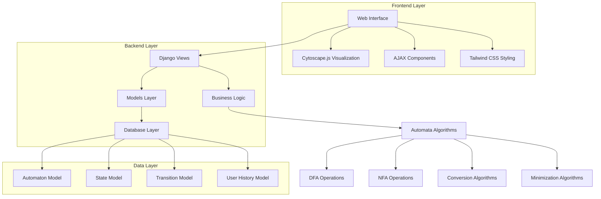
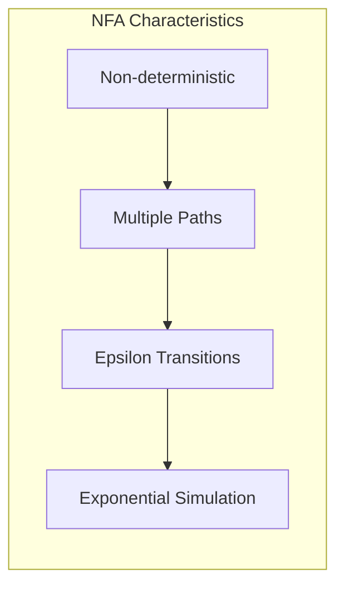
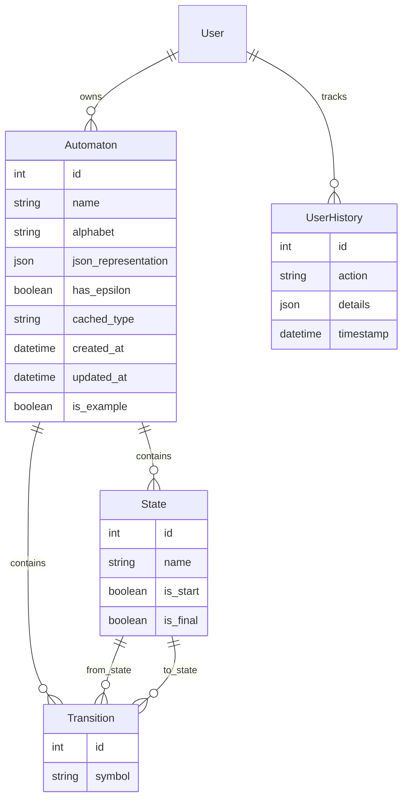
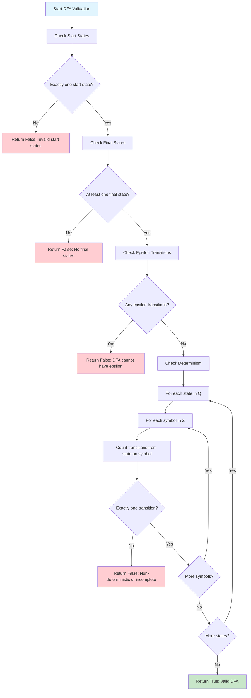
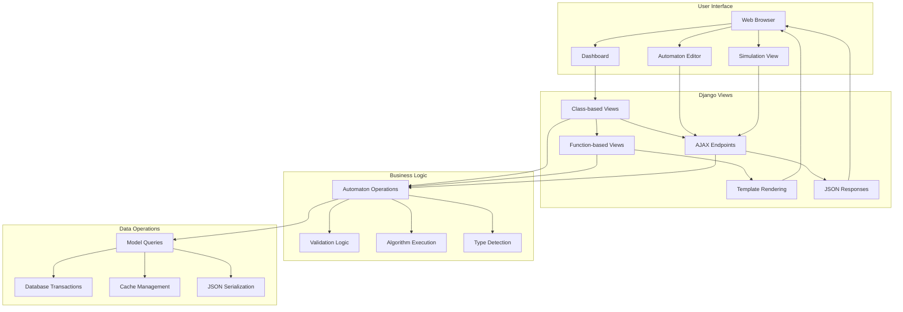
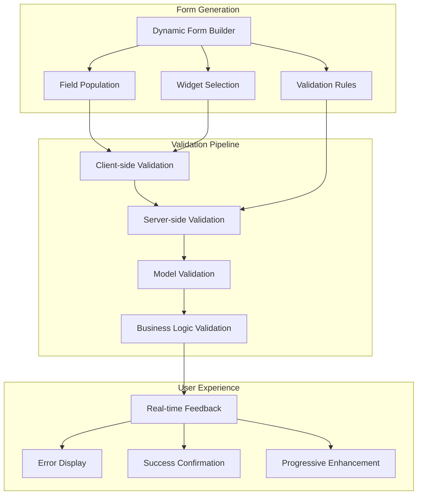

# Finite Automata System - Comprehensive Technical Report

## Table of Contents

1. [Introduction](#introduction)
2. [System Architecture](#system-architecture)
3. [Technologies Used](#technologies-used)
4. [Theoretical Foundations](#theoretical-foundations)
5. [Core Features](#core-features)
6. [Implementations](#implementations)
7. [Conclusion](#conclusion)

---

## Introduction

This comprehensive technical report details a sophisticated finite automata system designed for educational and research purposes. The system provides robust implementations of Deterministic Finite Automata (DFA), Non-deterministic Finite Automata (NFA), and their conversions, built on Django framework with modern web technologies.

### Key Achievements:
- **Complete DFA/NFA Implementation**: Full support for finite automata creation, simulation, and manipulation
- **Advanced Algorithms**: Subset construction (NFA→DFA), Myhill-Nerode minimization
- **Interactive Visualizations**: Real-time graph rendering with Cytoscape.js
- **Educational Tools**: Comprehensive type checking and step-by-step algorithm explanations
- **Modern Architecture**: Django-based with responsive design and AJAX interactions

---

## System Architecture

### High-Level Architecture



### System Components:
- **Frontend**: HTML5, CSS3 (Tailwind), JavaScript (ES6+)
- **Backend**: Django 5.2.4, Python 3.x
- **Database**: PostgreSQL with optimized indexing
- **Visualization**: Cytoscape.js for interactive graph rendering
- **Authentication**: Django's built-in user management

---

## Technologies Used

### Backend Technologies
- **Python 3.x**: Core programming language
- **Django 5.2.4**: Web framework for robust backend development
- **PostgreSQL**: Database for reliable data persistence
- **psycopg2-binary**: PostgreSQL adapter for Python

### Frontend Technologies
- **HTML5**: Modern markup language
- **CSS3**: Styling with Tailwind CSS framework
- **JavaScript (ES6+)**: Client-side interactivity
- **Cytoscape.js**: Advanced graph visualization library
- **AJAX**: Asynchronous data exchange

### Development Tools
- **Django-tailwind**: CSS framework integration
- **Django-browser-reload**: Development hot-reloading
- **Arrow**: Python datetime library
- **Jinja2**: Template engine

### Additional Libraries
- **PyYAML**: Configuration file parsing
- **Requests**: HTTP library for external API calls
- **Rich**: Enhanced terminal output for debugging

---

## Theoretical Foundations

### Introduction to Finite Automata

Finite automata are abstract machines used to recognize patterns in input sequences, forming the basis for understanding regular languages in computer science. They consist of states, transitions, and input symbols, processing each symbol step-by-step. If the machine ends in an accepting state after processing the input, it is accepted; otherwise, it is rejected. Finite automata come in deterministic (DFA) and non-deterministic (NFA) forms, both of which can recognize the same set of regular languages. They are widely used in text processing, compilers, and network protocols.

#### Features of Finite Automata

- **Input**: Set of symbols or characters provided to the machine
- **Output**: Accept or reject based on the input pattern
- **States of Automata**: The conditions or configurations of the machine
- **State Relation**: The transitions between states
- **Output Relation**: Based on the final state, the output decision is made

#### Formal Definition of Finite Automata

A finite automaton can be defined as a tuple:

**{Q, Σ, q₀, F, δ}**, where:
- **Q**: Finite set of states
- **Σ**: Set of input symbols (alphabet)
- **q₀**: Initial state
- **F**: Set of final states
- **δ**: Transition function

### Types of Finite Automata

There are two main types of finite automata:

1. **Deterministic Finite Automata (DFA)**
2. **Non-deterministic Finite Automata (NFA)**

#### 1. Deterministic Finite Automata (DFA)

A DFA is represented as **{Q, Σ, q₀, F, δ}**. In DFA, for each input symbol, the machine transitions to one and only one state. DFA does not allow any null transitions, meaning every state must have a transition defined for every input symbol.

**DFA Properties:**
- **Q**: Set of all states
- **Σ**: Set of input symbols (symbols which machine takes as input)
- **q₀**: Initial state (starting state of a machine)
- **F**: Set of final states
- **δ**: Transition function, defined as δ : Q × Σ → Q

**Example: DFA accepting strings ending with 'a'**

Given: Σ = {a, b}, Q = {q₀, q₁}, F = {q₁}

| State\Symbol | a  | b  |
|--------------|----|----|
| q₀           | q₁ | q₀ |
| q₁           | q₁ | q₀ |

```mermaid
graph LR
    subgraph "DFA Characteristics"
        A[Deterministic] --> B[Single Path]
        B --> C[Efficient Simulation]
        C --> D[O(n) Recognition]
    end
```

In this example, if the string ends in 'a', the machine reaches state q₁, which is an accepting state.

#### 2. Non-deterministic Finite Automata (NFA)

NFA is similar to DFA but includes the following features:
- It can transition to multiple states for the same input
- It allows null (ε) moves, where the machine can change states without consuming any input

**Example: NFA accepting strings ending with 'a'**

Given: Σ = {a, b}, Q = {q₀, q₁}, F = {q₁}

| State\Symbol | a        | b  |
|--------------|----------|----|
| q₀           | {q₀, q₁} | q₀ |
| q₁           | φ        | φ  |



In an NFA, if any transition leads to an accepting state, the string is accepted.

#### Comparison of DFA and NFA

Although NFAs appear more flexible, they do not have more computational power than DFAs. Every NFA can be converted to an equivalent DFA, although the resulting DFA may have more states.

- **DFA**: Single transition for each input symbol, no null moves
- **NFA**: Multiple transitions and null moves allowed
- **Power**: Both DFA and NFA recognize the same set of regular languages

### NFA to DFA Conversion Algorithm

An NFA can have zero, one or more than one move from a given state on a given input symbol. An NFA can also have NULL moves (moves without input symbol). On the other hand, DFA has one and only one move from a given state on a given input symbol.

#### Steps for Converting NFA to DFA:

**Step 1: Convert the given NFA to its equivalent transition table**
To convert the NFA to its equivalent transition table, we need to list all the states, input symbols, and the transition rules. The transition rules are represented in the form of a matrix, where the rows represent the current state, the columns represent the input symbol, and the cells represent the next state.

**Step 2: Create the DFA's start state**
The DFA's start state is the set of all possible starting states in the NFA. This set is called the "epsilon closure" of the NFA's start state. The epsilon closure is the set of all states that can be reached from the start state by following epsilon (ε) transitions.

**Step 3: Create the DFA's transition table**
The DFA's transition table is similar to the NFA's transition table, but instead of individual states, the rows and columns represent sets of states. For each input symbol, the corresponding cell in the transition table contains the epsilon closure of the set of states obtained by following the transition rules in the NFA's transition table.

**Step 4: Create the DFA's final states**
The DFA's final states are the sets of states that contain at least one final state from the NFA.

**Step 5: Simplify the DFA**
The DFA obtained in the previous steps may contain unnecessary states and transitions. To simplify the DFA, we can use the following techniques:
- Remove unreachable states: States that cannot be reached from the start state can be removed from the DFA
- Remove dead states: States that cannot lead to a final state can be removed from the DFA
- Merge equivalent states: States that have the same transition rules for all input symbols can be merged into a single state

**Step 6: Repeat steps 3-5 until no further simplification is possible**
After simplifying the DFA, we repeat steps 3-5 until no further simplification is possible. The final DFA obtained is the minimized DFA equivalent to the given NFA.

### Myhill-Nerode Theorem

The Myhill-Nerode theorem provides the theoretical foundation for DFA minimization and establishes the connection between regular languages and finite automata:

**Theorem**: A language L is regular if and only if it has a finite number of equivalence classes under the relation ≡_L.

**Equivalence Relation**: For strings x, y ∈ Σ*, x ≡_L y if and only if for all z ∈ Σ*, xz ∈ L ⟺ yz ∈ L.

This means two strings are equivalent if appending any string to both results in the same acceptance/rejection behavior.

#### Theoretical Implications:
- **Minimality**: The minimal DFA has exactly one state for each equivalence class
- **Uniqueness**: The minimal DFA is unique up to state renaming
- **Decidability**: Language regularity can be determined by counting equivalence classes

#### Minimization Process:
1. **Initial Partition P₀**: Separate final and non-final states
2. **Iterative Refinement**: For each partition Pᵢ, create Pᵢ₊₁ by splitting based on transition behavior
3. **Convergence Test**: Continue until Pₖ₊₁ = Pₖ (no further refinement possible)
4. **Construction**: Build minimal DFA where each equivalence class becomes a state

#### Practical Algorithm:
The table-filling algorithm efficiently implements this theorem:
- **Step 1**: Mark all pairs (p,q) where p is final and q is non-final
- **Step 2**: For each unmarked pair (p,q), check if δ(p,a) and δ(q,a) are marked for any symbol a
- **Step 3**: If so, mark (p,q) as distinguishable
- **Step 4**: Repeat until no new pairs are marked
- **Step 5**: Merge all unmarked pairs into equivalence classes

### Pumping Lemma for Regular Languages

The pumping lemma provides a method to prove that certain languages are not regular:

**Lemma**: If L is a regular language, then there exists a pumping length p such that for any string s ∈ L with |s| ≥ p, s can be divided into three parts s = xyz satisfying:
1. |xy| ≤ p
2. |y| > 0  
3. xyᵢz ∈ L for all i ≥ 0

**Proof Technique**: To prove a language is not regular, assume it is regular, apply the pumping lemma, and derive a contradiction.

### Closure Properties

Regular languages are closed under various operations:

#### Union and Intersection:
- **Union**: If L₁ and L₂ are regular, then L₁ ∪ L₂ is regular
- **Intersection**: If L₁ and L₂ are regular, then L₁ ∩ L₂ is regular
- **Complement**: If L is regular, then L̄ (complement) is regular

#### Concatenation and Kleene Star:
- **Concatenation**: If L₁ and L₂ are regular, then L₁L₂ is regular
- **Kleene Star**: If L is regular, then L* is regular

#### Construction Methods:
- **Product Construction**: For intersection and union of DFAs
- **Concatenation Construction**: Chain final states of first automaton to start state of second
- **Kleene Star Construction**: Add epsilon transitions from final states back to start

### Equivalence of Finite Automata and Regular Expressions

The fundamental theorem establishing equivalence between finite automata and regular expressions:

**Theorem**: A language is regular if and only if it can be described by a regular expression.

#### Proof Outline:
1. **Regular Expression → NFA**: Thompson's construction algorithm
2. **NFA → DFA**: Subset construction algorithm  
3. **DFA → Regular Expression**: State elimination method or Brzozowski's algebraic method

#### Thompson's Construction:
- **Base Cases**: ∅, ε, and single symbols
- **Union**: Parallel paths with epsilon transitions
- **Concatenation**: Sequential connection
- **Kleene Star**: Loop with epsilon transitions

#### State Elimination Method:
1. **Generalize**: Replace transitions with regular expressions
2. **Eliminate**: Remove states one by one, updating transition expressions
3. **Simplify**: Combine parallel edges and self-loops
4. **Final**: Extract regular expression from remaining structure

### Decision Problems

Several important decision problems for finite automata:

#### Membership Problem:
- **Input**: DFA/NFA A and string w
- **Question**: Does A accept w?
- **Complexity**: O(n) for DFA, O(n·2^m) for NFA where n = |w|, m = number of states

#### Emptiness Problem:
- **Input**: DFA/NFA A
- **Question**: Is L(A) = ∅?
- **Algorithm**: Check if any final state is reachable from start state
- **Complexity**: O(n) where n = number of states

#### Equivalence Problem:
- **Input**: DFAs A₁ and A₂
- **Question**: Is L(A₁) = L(A₂)?
- **Algorithm**: Check if (A₁ ∩ A₂̄) ∪ (A₁̄ ∩ A₂) = ∅
- **Complexity**: Exponential in worst case due to complementation

#### Minimality Problem:
- **Input**: DFA A
- **Question**: Is A minimal?
- **Algorithm**: Apply minimization algorithm and compare state counts
- **Complexity**: O(n²|Σ|) using Myhill-Nerode algorithm

---

## Implementations

The finite automata system is built using Django's Model-View-Controller architecture, providing a clean separation of concerns and maintainable codebase. This section covers the key implementation aspects that bring theoretical concepts to life through detailed flowcharts and architectural diagrams.

### System Architecture Overview

The system implements a unified architecture where both DFA and NFA share the same base classes, with type determination handled dynamically based on structural properties. This design provides flexibility while maintaining strong theoretical foundations.


### Core Model Architecture

The system's data models represent finite automata structures with intelligent relationships and validation. The following diagram illustrates the model relationships:



### Algorithm Implementations

The system implements core finite automata algorithms through a series of well-defined processes. Each algorithm follows theoretical principles while providing practical functionality for the web application.

#### DFA Validation Algorithm

The DFA validation process ensures theoretical correctness by checking all required properties of deterministic finite automata:



#### NFA Simulation Algorithm

The NFA simulation implements epsilon closure handling for non-deterministic behavior with comprehensive state set management:

```mermaid
flowchart TD
    A[Start NFA Simulation] --> B[Initialize: current_states = ε-closure(start_states)]
    B --> C[Input: string w = w₁w₂...wₙ]
    C --> D[i = 1]
    D --> E{i ≤ n?}
    E -->|No| F[Check if any current state is final]
    E -->|Yes| G[Read symbol wᵢ]
    G --> H[next_states = ∅]
    H --> I[For each state q in current_states]
    I --> J[Find all transitions δ(q, wᵢ)]
    J --> K[Add destination states to next_states]
    K --> L{More states in current_states?}
    L -->|Yes| I
    L -->|No| M[current_states = ε-closure(next_states)]
    M --> N{current_states empty?}
    N -->|Yes| O[Return False: String rejected]
    N -->|No| P[i = i + 1]
    P --> E
    F --> Q{Any final state in current_states?}
    Q -->|Yes| R[Return True: String accepted]
    Q -->|No| S[Return False: String rejected]
    
    style A fill:#e1f5fe
    style R fill:#c8e6c9
    style O fill:#ffcdd2
    style S fill:#ffcdd2
```

#### Subset Construction Algorithm (NFA to DFA Conversion)

The conversion process uses the powerset construction method with epsilon closure handling and systematic state exploration:

```mermaid
flowchart TD
    A[Start NFA to DFA Conversion] --> B[Compute ε-closure of NFA start states]
    B --> C[Create DFA start state q₀ = ε-closure(NFA start states)]
    C --> D[Initialize: unmarked_states = {q₀}, DFA_states = {q₀}]
    D --> E{unmarked_states empty?}
    E -->|Yes| F[Conversion Complete]
    E -->|No| G[Select unmarked state T from unmarked_states]
    G --> H[Mark T as processed]
    H --> I[For each symbol a in Σ]
    I --> J[U = ∅]
    J --> K[For each NFA state q in T]
    K --> L[U = U ∪ δ(q, a)]
    L --> M{More states in T?}
    M -->|Yes| K
    M -->|No| N[U = ε-closure(U)]
    N --> O{U ≠ ∅?}
    O -->|No| P{More symbols in Σ?}
    O -->|Yes| Q{U in DFA_states?}
    Q -->|No| R[Add U to DFA_states and unmarked_states]
    Q -->|Yes| S[Skip - state already exists]
    R --> T[Create DFA transition δ'(T, a) = U]
    S --> T
    T --> P
    P -->|Yes| I
    P -->|No| E
    F --> U[Set final states: any DFA state containing NFA final state]
    U --> V[Return constructed DFA]
    
    style A fill:#e1f5fe
    style V fill:#c8e6c9
    style F fill:#fff3e0
```

#### Myhill-Nerode Minimization Algorithm

The DFA minimization process implements the Myhill-Nerode theorem through iterative partition refinement:

```mermaid
flowchart TD
    A[Start DFA Minimization] --> B[Create initial partition P₀]
    B --> C[P₀ = {Final_states, Non_final_states}]
    C --> D[k = 0]
    D --> E[For each set S in Pₖ]
    E --> F{|S| = 1?}
    F -->|Yes| G[Add S to Pₖ₊₁ unchanged]
    F -->|No| H[Check distinguishability within S]
    H --> I[For each pair (p,q) in S]
    I --> J[For each symbol a in Σ]
    J --> K[Find δ(p,a) and δ(q,a)]
    K --> L{δ(p,a) and δ(q,a) in same partition?}
    L -->|No| M[p and q are distinguishable]
    L -->|Yes| N{More symbols?}
    N -->|Yes| J
    N -->|No| O[p and q are equivalent]
    O --> P{More pairs in S?}
    M --> Q[Split S into distinguishable subsets]
    P -->|Yes| I
    P -->|No| R[Keep S as single partition]
    Q --> S[Add subsets to Pₖ₊₁]
    R --> T[Add S to Pₖ₊₁]
    G --> U{More sets in Pₖ?}
    S --> U
    T --> U
    U -->|Yes| E
    U -->|No| V{Pₖ₊₁ = Pₖ?}
    V -->|No| W[k = k + 1, continue with Pₖ₊₁]
    V -->|Yes| X[Partition stabilized]
    W --> E
    X --> Y[Construct minimized DFA from equivalence classes]
    Y --> Z[Return minimized DFA]
    
    style A fill:#e1f5fe
    style Z fill:#c8e6c9
    style X fill:#fff3e0
```

#### String Matching and Recognition Flow

The system provides unified string simulation supporting both DFA and NFA with detailed path tracking:

```mermaid
flowchart TD
    A[Input String w] --> B[Determine Automaton Type]
    B --> C{DFA or NFA?}
    C -->|DFA| D[DFA Simulation Path]
    C -->|NFA| E[NFA Simulation Path]
    
    D --> F[current_state = start_state]
    F --> G[Read next symbol]
    G --> H[Find unique transition δ(current_state, symbol)]
    H --> I{Transition exists?}
    I -->|No| J[Return False: No valid transition]
    I -->|Yes| K[Update current_state]
    K --> L{More symbols?}
    L -->|Yes| G
    L -->|No| M{current_state is final?}
    M -->|Yes| N[Return True: String accepted]
    M -->|No| O[Return False: String rejected]
    
    E --> P[current_states = ε-closure(start_states)]
    P --> Q[Read next symbol]
    Q --> R[next_states = ∅]
    R --> S[For each state in current_states]
    S --> T[Find transitions δ(state, symbol)]
    T --> U[Add destinations to next_states]
    U --> V[current_states = ε-closure(next_states)]
    V --> W{current_states empty?}
    W -->|Yes| X[Return False: No valid path]
    W -->|No| Y{More symbols?}
    Y -->|Yes| Q
    Y -->|No| Z{Any current_state is final?}
    Z -->|Yes| AA[Return True: String accepted]
    Z -->|No| BB[Return False: String rejected]
    
    style A fill:#e1f5fe
    style N fill:#c8e6c9
    style AA fill:#c8e6c9
    style J fill:#ffcdd2
    style O fill:#ffcdd2
    style X fill:#ffcdd2
    style BB fill:#ffcdd2
```

### View Architecture and Request Flow

The web application implements a comprehensive MVC architecture with both traditional Django views and modern AJAX endpoints:



### Forms and Validation Architecture

The forms layer provides intelligent form generation that adapts to automaton type and context:



---

## Core Features

The finite automata system provides a comprehensive suite of features designed to support both educational and research applications in theoretical computer science.

### 1. Automaton Creation and Management
The system offers a unified interface for creating and managing both Deterministic Finite Automata (DFA) and Non-deterministic Finite Automata (NFA). Users can create automata through an intuitive web interface with dynamic type detection that automatically classifies the automaton based on its structural properties. The system supports bulk operations for efficient creation of multiple states and transitions simultaneously, while providing real-time validation to ensure structural integrity and theoretical compliance.

### 2. Interactive Visualization
A sophisticated visualization system built on Cytoscape.js provides professional graph rendering capabilities. The interface offers real-time updates during editing, allowing users to see immediate visual feedback as they modify their automata. Multiple layout algorithms are available to optimize the visual representation, and state highlighting provides clear visual feedback during string simulation and algorithm execution.

### 3. String Simulation
The system implements comprehensive string simulation capabilities for both DFA and NFA types. DFA simulation operates with efficient O(n) time complexity, while NFA simulation includes complete epsilon closure handling for non-deterministic behavior. Detailed execution traces are maintained throughout the simulation process, with visual feedback highlighting the path taken during string processing.

### 4. Advanced Algorithms
Core theoretical algorithms are fully implemented, including NFA to DFA conversion using the subset construction method and DFA minimization based on the Myhill-Nerode theorem. The system includes comprehensive type checking and validation systems to ensure theoretical correctness, with performance optimizations through caching and database indexing.

### 5. Educational Tools
Extensive educational support includes step-by-step algorithm explanations, a curated library of example automata, and structured exercise systems for progressive learning. User activity monitoring and history tracking provide insights into learning progress and system usage patterns.

---

## Conclusion

This finite automata system represents a comprehensive implementation of theoretical computer science concepts with practical applications. The system successfully combines robust theoretical foundations with modern web development practices to create an interactive platform.

### Technical Implementation

The system provides complete algorithm implementations including DFA operations with full validation, simulation, and minimization using the Myhill-Nerode theorem. NFA operations offer comprehensive support including epsilon transitions and non-deterministic behavior. Conversion algorithms implement subset construction for NFA-to-DFA conversion with detailed step tracking, while advanced features include symbol range support, multiple symbol transitions, and intelligent type detection.

The modern architecture utilizes Django framework for scalable MVC design with efficient database modeling. Real-time interaction is achieved through AJAX-based user interfaces with dynamic state and transition management. The responsive design employs Tailwind CSS for consistent styling across devices, while database optimization includes indexed queries, caching strategies, and efficient relationship management.

Interactive visualization features Cytoscape.js integration for professional graph rendering with customizable layouts. Dynamic updates enable real-time graph modifications during editing, with step-by-step algorithm execution and intuitive controls for automaton creation and manipulation.

### Future Enhancements:

#### Regular Expression Integration
- **Thompson's Construction**: Automatic conversion from regular expressions to NFAs
- **State Elimination**: Conversion from DFAs back to regular expressions
- **Pattern Matching**: Integration with real-world pattern matching applications
- **Syntax Highlighting**: Enhanced user interface for regular expression editing

#### Advanced Automata Support
- **Pushdown Automata**: Extension to context-free languages and grammars
- **Turing Machines**: Implementation of more powerful computational models
- **Two-Way Automata**: Support for bidirectional tape movement
- **Probabilistic Automata**: Introduction of probabilistic transitions

#### Enhanced User Experience
- **Collaborative Features**: Multi-user automaton sharing and editing
- **Import/Export**: Support for standard automaton file formats
- **Performance Monitoring**: Analytics and optimization tools
- **Mobile Optimization**: Enhanced mobile interface for on-the-go learning

#### Research Extensions
- **Complexity Analysis**: Automated complexity analysis for user-created automata
- **Equivalence Testing**: Advanced algorithms for automaton equivalence checking
- **Optimization Algorithms**: Alternative minimization and optimization techniques
- **Formal Verification**: Integration with formal verification tools

### System Impact:

The system successfully bridges the gap between theoretical computer science concepts and practical implementation, providing:

1. **Educational Tool**: Comprehensive platform for learning finite automata theory
2. **Research Platform**: Foundation for advanced research in automata theory
3. **Practical Application**: Real-world implementation of theoretical algorithms
4. **Modern Interface**: User-friendly design encouraging exploration and learning

### Technical Innovation:

- **Unified Model Architecture**: Single codebase supporting both DFA and NFA with dynamic type detection
- **Advanced Symbol Handling**: Support for symbol ranges and multiple symbols in transitions
- **Comprehensive Validation**: Theoretical compliance checking with detailed error reporting
- **Performance Optimization**: Efficient algorithms with caching and indexing strategies

The system demonstrates successful integration of theoretical foundations with practical implementation, providing a robust platform for finite automata research and education. It serves as both a learning tool for students and a research platform for educators, combining the rigor of theoretical computer science with the accessibility of modern web applications.

---

*Report Generated: 2025-07-18*  
*System Version: 1.0*  
*Django Framework: 5.2.4*  
*Total Lines of Code: ~3,000+*  
*Architecture: MVC with AJAX Integration*